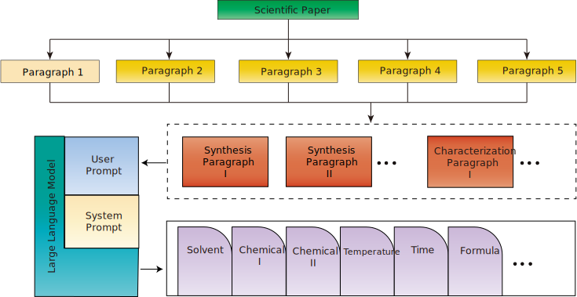

# ZIF-8 Size Prediction Data Pipeline


## Workflow Diagram




## Project Structure

```
├── Extraction.ipynb          
├── datapipe.ipynb          
├── ML_Training_SHAP.ipynb   
├── GA_Inverse_Optimization.ipynb  
├── Data/                     
├── toolkit/                
│   ├── parsing_from_spider.py   
│   ├── extract_data.py           
│   ├── logger.py                 
│   └── file_path.py             
├── Spider/                   
│   ├── fulltext.py              
│   ├── pipelines.py             
│   └── settings.py               
└── asset/                    
    └── Extraction.svg        
```

